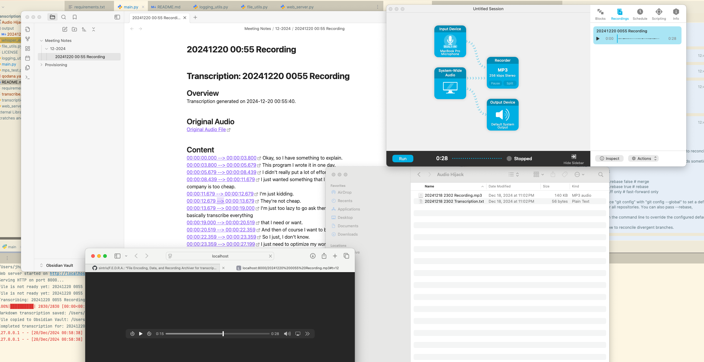

# FEDRA: Flexible, Easy, and Dynamic Recorder Automation

## Overview
FEDRA is a lightweight tool designed to streamline the transcription of audio files using OpenAI Whisper. With integrated logging, a web server, and organized Markdown output, this program ensures a seamless workflow for researchers and professionals alike.

---

## Features
- **Automatic Transcription:** Uses OpenAI Whisper for accurate transcriptions.
- **Web Server:** Easily access audio files via a built-in web server.
- **Markdown Output:** Save transcriptions in organized, timestamped Markdown files.
- **Dynamic Folder Creation:** Automatically organizes files into monthly subdirectories in your Obsidian Vault.

---

## Device Options: CPU enabled by default.
- **CPU**: Use if no GPU is available or if GPU is not desired.
- **CUDA**: For Nvidia GPUs supporting CUDA (requires PyTorch with CUDA).
- **MPS**: For Apple Silicon devices (M1/M2 chips) using Metal Performance Shaders.
- **OpenCL**: If supported by hardware and libraries.
- **DirectML**: For Windows environments using DirectML (via ONNX Runtime or PyTorch DirectML backend).

**Example**:
```bash
import torch
device = torch.device("cuda" if torch.cuda.is_available() else "cpu")
```

---

## Installation

### 1. Clone the Repository
```bash
git clone https://github.com/your-repo/fedra.git
cd fedra
```

### 2. Setup a Virtual Environment
```bash
python3 -m venv whisper_env
source whisper_env/bin/activate
```

### 3. Install Dependencies
```bash
pip install -r requirements.txt
```

---

## Usage

### 1. Prepare Your Input Folder:
Place audio files (`.mp3`, `.wav`, `.m4a`) into the designated input folder (default: `Audio Hijack`).

### 2. Run the Main Script:
```bash
python main.py
```

### 3. Access the Web Server:
After starting the program, visit the web server to access audio files:
```
http://localhost:8000
```

### 4. View Generated Markdown:
Markdown files are saved in the output folder and organized into monthly directories under your Obsidian Vault.

### 5. Stop Gracefully:
Use `Ctrl+C` to gracefully terminate the program.

---

## Configuration

- **Input Folder:** Set the path to the folder containing your audio files (default: `/Users/jhumphreys/Music/Audio Hijack`).
- **Output Folder:** Set the path for the transcriptions (default: `/Users/jhumphreys/Scripts/transcription/output`).
- **Obsidian Vault:** Update the path to your Obsidian Vault for Markdown files (default: `/Users/jhumphreys/Documents/Obsidian Vault/Meeting Notes`).

You can modify these paths in the `main.py` file.

---

## File Structure
```plaintext
fedra/
├── main.py           # Entry point of the program
├── transcription.py  # Transcription logic using Whisper
├── web_server.py     # Lightweight web server logic
├── file_utils.py     # Helper functions for file handling
├── logging_utils.py  # Logging setup and utilities
├── requirements.txt  # Python dependencies
├── output/           # Transcribed Markdown files
├── Audio Hijack/     # Default input folder for audio files
└── README.md         # Project documentation
```

---

## Example Output

### Markdown File
```markdown
# Transcription: 2024-12-19 2051 Recording

## Overview
Transcription generated on 2024-12-19 20:51:00.

## Original Audio
[Original Audio File](http://localhost:8000/2024-12-19_2051_Recording.mp3)

## Content
[00:00:00 --> 00:01:00](http://localhost:8000/2024-12-19_2051_Recording.mp3#t=0) Sample transcription text...
[00:01:00 --> 00:02:00](http://localhost:8000/2024-12-19_2051_Recording.mp3#t=60) More transcription text...
```

### Directory Structure
```plaintext
/Meeting Notes/
└── 12-2024/
    └── 2024-12-19_2051_Recording.md
```

---

## License
This project is licensed under the MIT License - see the [LICENSE](LICENSE) file for details.

---

## Contributing
We welcome contributions! Feel free to submit pull requests or open issues.

1. Fork the repository.
2. Create a feature branch: `git checkout -b feature-name`.
3. Commit your changes: `git commit -m 'Add a feature'`.
4. Push to the branch: `git push origin feature-name`.
5. Open a pull request.

---

## Acknowledgments
- [OpenAI Whisper](https://github.com/openai/whisper) for transcription capabilities.
- The Python community for tools like `http.server`, `logging`, and `shutil`.
